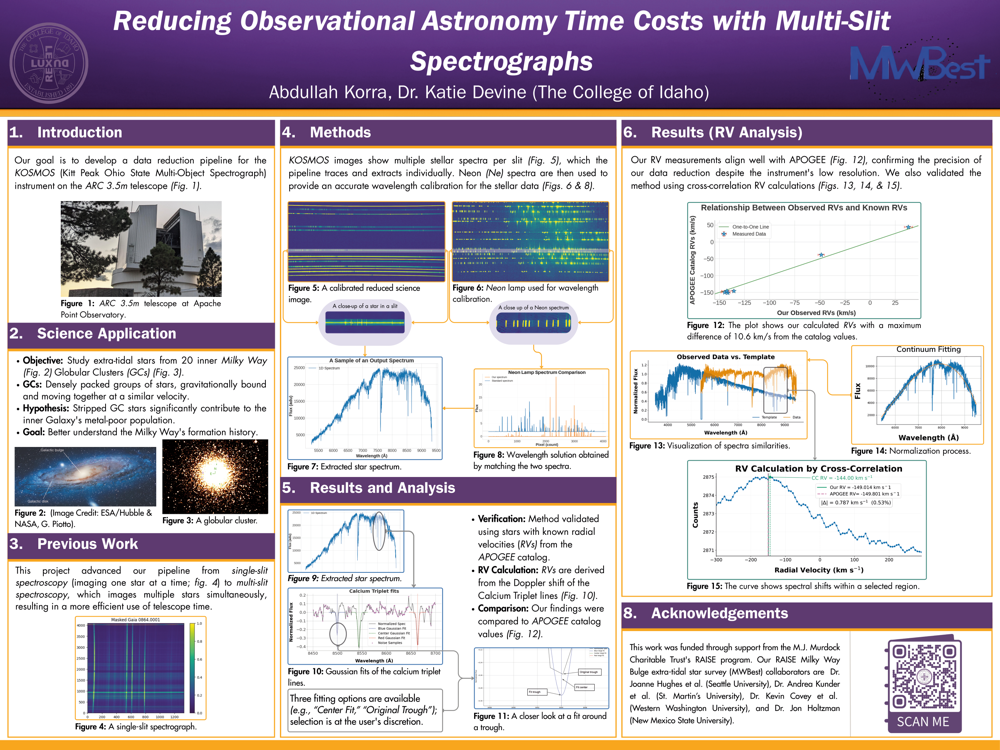
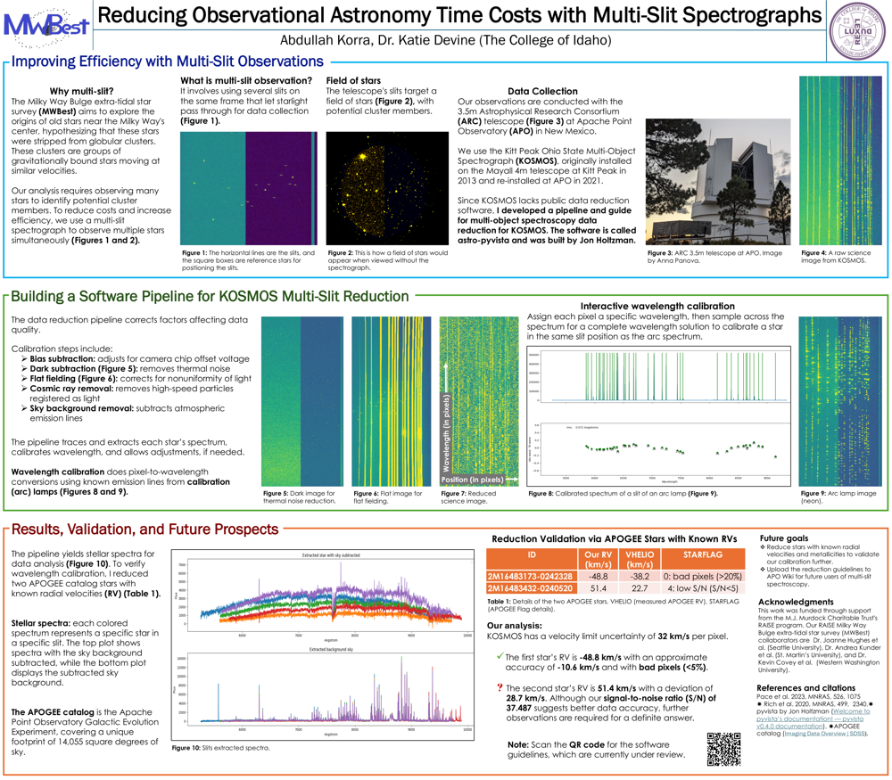

## Selected Projects

This page highlights work in astronomy software, robotics, and machine learning. The goal is to show range without losing focus.

### KOSMOS Multi-Slit Data Reduction Pipeline {#kosmos}

::: {.project-card}
A Python and Jupyter-based astronomy workflow for reducing KOSMOS multi-slit spectroscopic data. The project is built around an interactive workflow that helps move from raw observations to final science products with cleaner user interaction than a loose notebook sequence.

::: [Python]{.tech-pill}
[Jupyter]{.tech-pill}
[Scientific Computing]{.tech-pill}
[Data Reduction]{.tech-pill}
[Astronomy]{.tech-pill}
:::

<!-- {.badge-row}
[Python]{.badge}
[Jupyter]{.badge} -->
<!-- [Scientific Computing]{.badge} -->

**Why it matters.** This is the most distinctive project on the site because it combines domain knowledge, tool-building, and user experience. It reads as original technical work rather than a standard class assignment.

**What it shows.**
- Software design for research workflows
- Scientific computing in Python
- Reproducible analysis habits
- Communication of a technical process to users

[GitHub repository](https://github.com/mwbest/CofI_2025)
:::

### Agribot {#agribot}

::: {.project-card}
An affordable agricultural robotics concept focused on embedded control, motion planning, and practical design under real-world constraints. The long-term motivation is to build technology that is actually usable in resource-constrained farming communities.

:::[Python]{.tech-pill}
[Arduino]{.tech-pill}
[Raspberry Pi]{.tech-pill}
[Embedded Control]{.tech-pill}
[Robotics]{.tech-pill}
:::

<!-- {.badge-row} -->

**Why it matters.** This project shows that my technical interests are not limited to pure analysis. I also build around hardware, sensors, control logic, and physical systems.

**What it shows.**
- Systems thinking
- Rapid prototyping
- Practical engineering tradeoffs
- Strong motivation for applied problem solving
:::

### Customer Churn Modeling {#churn}

::: {.project-card}
A prose-first Quarto report on customer churn prediction using Python, pandas, scikit-learn, classification models, cross-validation, and ROC-AUC. The writeup is designed to read like a professional analysis memo rather than a homework notebook.

:::[pandas]{.tech-pill}
[scikit-learn]{.tech-pill}
[Classification]{.tech-pill}
[Cross-Validation]{.tech-pill}
[ROC-AUC]{.tech-pill}
[Git]{.tech-pill}
:::

**Why it matters.** This is the most recruiter-friendly project on the site. It directly mirrors the language used in many entry-level data science and ML job descriptions.

**What it shows.**
- Exploratory data analysis
- Feature engineering and preprocessing
- Logistic regression and tree-based modeling
- Performance analysis with clean narrative structure

[Open the report](analysis/telco-churn-report.qmd)
:::

### Poster Presentations {#posters}

These materials show the research side of the astronomy work and make the project feel more complete. They also show that the work can be explained clearly in a public presentation format.

::: {.poster-grid}

::: {.poster-card}
[{.poster-thumb alt="Poster thumbnail for Reducing Observational Astronomy Time Costs with Multi-Slit Spectrographs."}](assets/posters/reducing-observational-astronomy-time-costs-with-multi-slit-spectrographs.pdf)

### Reducing Observational Astronomy Time Costs with Multi-Slit Spectrographs

Focuses on the KOSMOS reduction pipeline, science motivation, RV analysis, and validation against APOGEE values.

[Open PDF](assets/posters/reducing-observational-astronomy-time-costs-with-multi-slit-spectrographs.pdf)
:::

::: {.poster-card}
[{.poster-thumb alt="Poster thumbnail for the final multi-slit poster."}](assets/posters/final-multi-slit-poster.pdf)

### Final Multi-Slit Poster

A revised poster version that foregrounds pipeline construction, extracted spectra, wavelength calibration, and future validation work.

[Open PDF](assets/posters/final-multi-slit-poster.pdf)
:::

::: {.poster-card}

  
Future poster or presentation

### Placeholder for future research output

Reserved for another poster, slide deck, or technical presentation.
:::

:::

### Future Regression Project {#future-regression}

::: {.project-card}
Reserved for a second polished report centered on regression, RMSE, and model comparison. A strong follow-up option is a house-price or energy-usage problem with clearer continuous outcomes.
:::
